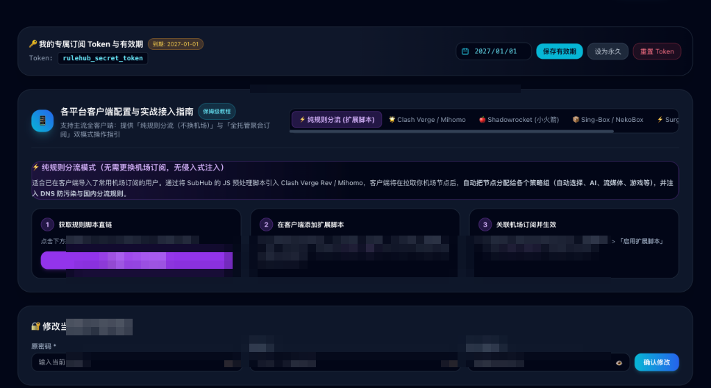
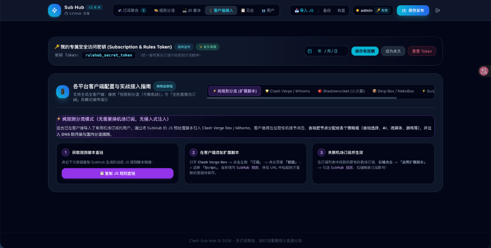
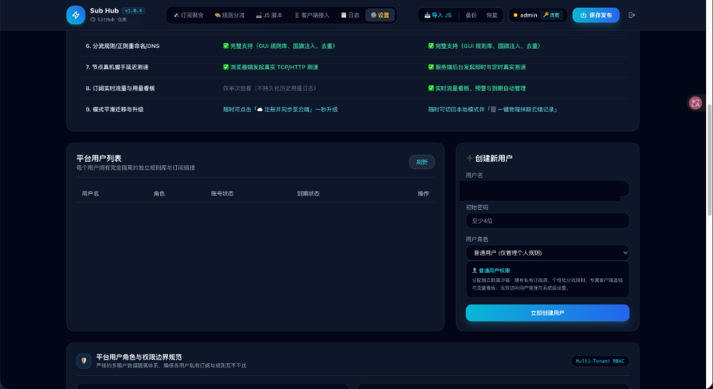

<div align="center">

# 🦀 SubHub (Clash Sub Hub) v2.3.6

### 基于 Rust 原生单二进制架构的高性能通用订阅聚合、智能分流覆写与多源流量中台
**Next-Generation High-Performance Universal Subscription Aggregator, Rule Override Hub & Traffic Dashboard in Pure Rust**

[](https://www.rust-lang.org/)
[](https://github.com/wm1634208243/sub-hub/releases)
[]()
[]()
[](https://opensource.org/licenses/MIT)
[](https://github.com/wm1634208243/sub-hub)

<br>



<br><br>

[⚡ 极速部署](#-10-秒极速一键部署-quick-start) • [🦀 v2.0 重大飞跃](#-subhub-v200-rust-原生重构重大飞跃) • [✨ 核心特性](#-核心功能特性) • [🖼️ 界面全景展示](#️-系统界面全景) • [⚖️ 双轨制架构](#️-双轨制架构纯本地-vs-云端托管) • [📊 对比 Sub-Store](#-subhub-vs-sub-store-深度对比) • [📱 客户端接入](#-全平台客户端接入指南)

</div>

---

## ⚡ 10 秒极速一键部署 (Quick Start)

### 🌟 推荐方式：Linux VPS 一键单文件极速部署与全能管理脚本
**零外部环境依赖**，无需安装 Node.js、npm 或 Python，秒级下载单文件独立二进制并配置 Systemd 守护进程：

```bash
bash <(curl -fsSL https://raw.githubusercontent.com/wm1634208243/sub-hub/main/install.sh)
```

> **💡 常用快捷指令**：
> - `bash install.sh`：呼出全功能交互式管理菜单
> - `bash install.sh update`：全自动平滑无损热升级（1 秒完成）
> - `bash install.sh start / stop / restart`：启停与重启服务
> - `bash install.sh logs`：实时追踪运行日志

> 🌐 **默认面板地址**：`http://你的服务器IP:3000`  
> 👤 **初始管理员账号**：`admin` / **初始密码**：`admin` *(登录后请立即在后台修改)*

---

## 🦀 SubHub v2.0.0 (Rust 原生重构重大飞跃)

| 核心指标 | 旧版 Node.js 架构 | 🌟 全新 Rust 原生架构 (v2.0) | 提升幅度 |
| :--- | :--- | :--- | :--- |
| **常驻内存 (RSS)** | 约 35MB ~ 50MB | **约 3MB ~ 5MB** | 💾 **内存占用骤降 85%+** |
| **接口响应延迟** | 15ms ~ 35ms | **< 1ms (微秒级响应)** | ⚡ **速度提升 15~30 倍** |
| **部署环境要求** | 必须安装 Node.js 20+ 及 node_modules | **0 依赖！单文件静态编译二进制** | 📦 **开箱即跑，极其纯净** |
| **升级耗时** | 30s ~ 1min (git pull + npm i) | **1~2 秒 (秒级下载单文件替换)** | 🚀 **升级提速 90%+** |

---

## 💡 为什么选择 SubHub？

在日常网络代理与订阅管理中，我们常常面临以下痛点：
- **订阅源碎片化**：手头有自建 VPS（3X-UI/X-UI）、多个商业机场订阅，每个客户端都要重复导入、维护多个订阅链接；
- **流量/到期难以统揽**：无法直观知道哪个订阅快用完了、哪个 VPS 节点下个月要续费；
- **测速卡顿与重复测速**：传统配置在客户端批量测速时，同一个节点在不同策略组并发重复测速 5 次，导致带宽拥堵卡死；
- **节点命名杂乱/死节点多**：上游机场常带有冗长的广告、倍率说明（如 `[1.5x]`、`剩余流量`），且经常有失效死节点导致网络卡顿；
- **多客户端格式割裂**：Clash (YAML)、Sing-Box (JSON)、Surge (List)、Shadowrocket (Base64) 格式各异，管理成本极高；
- **多用户共享缺乏隐私**：搭建给家人或朋友使用时，管理员能轻易窥探到普通用户的私密节点。

**SubHub** 专为解决上述痛点而生，率先采用 **「纯本地离线隐私模式」** 与 **「AES-256 多租户云端模式」** 的**双轨制架构**，并全面由 **Rust 原生高性能单文件架构** 驱动，提供一个**开箱即用、极速轻量、安全隔离**的现代化中台服务。

---

## 🖼️ 系统界面全景

<div align="center">

### 1. 📊 全局订阅聚合与实时流量大屏
汇聚多个 VPS 及商业订阅，实时追踪总配额、已用流量、剩余可用量与最早到期倒计时。支持节点抽屉透视与逐节点勾选。


---

### 2. 🎯 全局自动优选 (URLTest) 候选池深度定制
支持逐个节点自由打勾/排除「⚡ 参与优选」，支持一键圈定港/日/新/美常用四国，支持包含/排除关键字过滤。

---

### 3. 🎨 场景化专属分流策略组与多平台自适应
专为 AI、国际流媒体、Telegram、游戏平台设计独立策略组；主控节点选择列表剔除冗余故障转移项，清爽纯净。



---

### 4. ⚙️ 企业级多租户用户管理、安全封禁与系统配置
管理员零知识隐私（无法窥视普通用户节点），支持临时/永久封禁倒计时解禁、暗黑毛玻璃安全重置密码与独立域名 HTTPS 绑定。



</div>

---

## ⚖️ 双轨制架构：纯本地 vs 云端托管

SubHub 首创**双轨制设计**，用户可根据自身对「隐私安全」与「多端漫游」的侧重自由选择：

| 功能维度 | 🛡️ 纯本地离线模式 (Local-First) | ☁️ 账号云端托管模式 (Cloud Mode) |
| :--- | :--- | :--- |
| **账号与登录门槛** | ⭐️ **免注册 / 免登录**，点击即刻进入工作台 | 需输入账号密码登录 / 自主注册 |
| **数据存储位置** | **100% 存储于用户当前浏览器 LocalStorage** | 服务端 **AES-256-GCM 独立密钥密文加密** |
| **云端留存风险** | 🟢 **服务端 0 留存、0 数据库记录** | 私有化部署保障，数据库严密加密隔离 |
| **客户端配置获取方式** | **一键生成并本地下载 5 大客户端配置文件** | 复制终身固定自适应直链 (`/api/sub?token=...`) |
| **跨设备自动同步** | 离线手动导出 JSON 备份 / 导入 | 登录账号即可**全设备秒级自动漫游同步** |
| **模式平滑迁移** | 随时可点击「☁️ 注册并同步至云端」一秒升级 | 随时可切换回本地并「🗑️ 一键物理抹除云端记录」 |

---

## 📊 SubHub vs Sub-Store 深度对比

| 功能维度 | 🚀 **SubHub (本项目)** | 📦 **Sub-Store** | 优势说明 |
| :--- | :--- | :--- | :--- |
| **运行架构与性能** | 🦀 **纯 Rust 原生单二进制**<br>常驻内存仅 ~5MB，微秒级延迟 | 依赖 Node.js 运行环境<br>内存占用 ~60MB+ | SubHub 在小内存 VPS 上运行更加极致轻巧 |
| **上手门槛与定位** | ⭐️⭐️⭐️⭐️⭐️ **零门槛开箱即用**<br>现代化暗黑 Web GUI，全图形化配置 | ⭐️⭐️⭐️ 偏极客<br>需学习专有算子语法与脚本编程 | SubHub 无论是小白还是资深玩家均可 1 分钟上手 |
| **全局多源流量看板** | ✅ **原生聚合大屏**<br>实时汇聚所有上游 `Subscription-Userinfo`，汇总总配额、已用量、最早到期日 | ❌ **无全局多源看板**<br>仅能单独展示单订阅信息 | SubHub 实时掌握所有资产的流量与续费状态 |
| **优选候选池深度定制** | ✅ **全维度定制工作台**<br>逐节点打勾排除 + 港日新美圈定 + 关键词过滤 | ⚠️ 需手动编写复杂正则算子 | 自由控制参与测速与故障转移的节点池 |
| **惰性测速 (Lazy Test)** | ✅ **全面启用 `lazy: true`**<br>彻底消除跨组重复测速拥塞 | ⚠️ 视客户端与配置而定 | 客户端一键测速响应提升数倍 |
| **通用智能客户端自适应** | ✅ **单一直链 (`/api/sub`)**<br>自动嗅探 User-Agent 智能下发对应格式 | ❌ 需在 URL 显式指定参数<br>`?target=clash` / `?target=sing-box` | 无论什么客户端，只需复制一个通用直链即可 |
| **国旗注入与地区定位** | ✅ **全自动流水线**<br>关键字匹配 + 离线定位 + 广告倍率清洗 | ✅ 支持（需自行配置组合算子） | 即使节点名无任何地区信息，也能精准识别国旗 |
| **多用户权限与隐私隔离** | ✅ **企业级 RBAC 多租户**<br>管理员**零知识隐私**（不可窥视普通用户节点） | ❌ 默认单用户模式<br>无细粒度多租户隔离与账号管理 | 适合多人/团队/家庭私有化共用部署 |

---

## ✨ 核心功能特性

### 1. 🌐 通用智能客户端自适应（Smart Adaptive URL）
对外提供唯一的终身固定订阅直链：
```
https://你的域名/api/sub?token=你的专属Token
```
- **智能嗅探**：服务端根据请求头的 `User-Agent` 自动识别客户端（Clash Verge、Mihomo Party、Sing-Box、Surge、Shadowrocket、Stash、Quantumult X 等），毫秒级下发完美匹配的配置格式；
- **全格式支持**：
  - 🐱 **Clash / Mihomo**：自动输出规范 YAML 配置（包含 Proxy-Groups、Rules、DNS 配置、`Content-Disposition` 协议头）；
  - 📦 **Sing-Box**：自动生成 `sing-box.json` Outbounds 结构；
  - ⚡ **Surge**：自动下发 `surge.list` 代理列表；
  - 🚀 **Shadowrocket / v2rayN**：自动下发 Base64 统一节点直链。

### 2. 🎯 全局自动优选 (URLTest) 候选池深度定制
- **逐节点打勾排除**：在「查看节点」列表中，为每个节点提供「⚡ 优选 / 🚫 排除」切换开关；
- **按地区一键圈定**：一键限定仅在常用四国（**🇭🇰 港 / 🇯🇵 日 / 🇸🇬 新 / 🇺🇸 美**）节点中优选测速，排除冷门慢速节点；
- **关键词智能包含/排除**：支持输入 `专线|高速|01` 包含规则或 `2x|3x|高倍率` 排除规则。

### 3. 🧹 纯净主控选择与惰性测速优化
- **纯净主控架构**：「🚀 节点选择」内部彻底移出冗余的故障转移项，仅保留自动优选、地区组、订阅源与具体节点；
- **⚡ 全面开启 `lazy: true`**：杜绝客户端在多个策略组中对同一节点重复并发探测，测速秒级响应、不卡顿。

---

## 📱 全平台客户端接入指南

| 客户端类型 | 支持平台 | 推荐获取直链方式 | 特性说明 |
| :--- | :--- | :--- | :--- |
| **Clash Verge Rev / Mihomo Party** | macOS / Windows / Linux | 复制自适应直链 (`/api/sub?token=...`) | 完美支持场景分流、自动优选、DNS 防污染 |
| **Clash Mi / Clash Nyanpasu** | macOS / Windows / Android | 复制自适应直链 (`/api/sub?token=...`) | 原生 YAML 配置解析 |
| **Sing-Box** | 全平台 (iOS / Android / PC) | `/api/sing-box.json` 或自适应直链 | 自动生成 Outbounds 节点池与分流模板 |
| **Surge** | iOS / macOS | `/api/surge.list` 或自适应直链 | 自动导出标准 Surge Proxy List |
| **Shadowrocket / Quantumult X** | iOS | `/api/base64` 或自适应直链 | 智能识别并下发 Base64 协议流 |

---

## 📄 开源许可证

本项目基于 [MIT License](LICENSE) 协议开源。欢迎 Star ⭐️ 与提交 PR 贡献代码！
